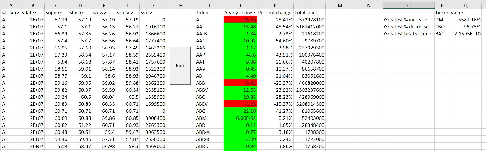
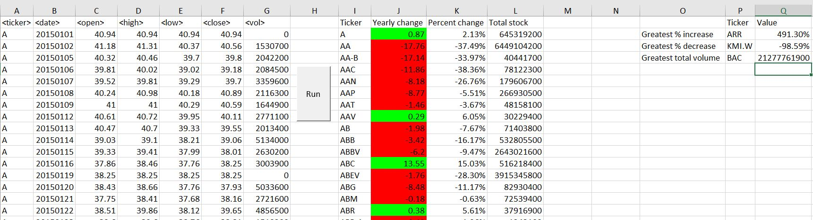
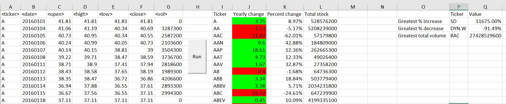

## Visual Basic for Applications in Excel - The VBA of Wall Street

### Stock market analyst

* Script that loop through all the stocks for one year and output the ticker, yearly change, percent change and stock volume.

# Results

